<a href="">
    
</a>

# CorgiSHOP E-Commerce React

[](https://reactjs.org/)
[](https://tailwindcss.com/)
[](https://nodejs.org/)
[](https://www.mysql.com/)
[](https://sequelize.org/)
[](https://axios-http.com/)
[](https://vitejs.dev/)
[](https://nodemon.io/)

:star: Forneça estrelas se gostou do projeto.

[CorgiSHOP](https://github.com/PatrickSoares-Dev/CorgiSHOP) é um projeto de e-commerce desenvolvido em React e Node.js, criado especialmente para amantes de pets e seus companheiros de quatro patas. Este aplicativo web foi desenvolvido a fins educacionais para hospedagem de servidores e banco de dados na AWS.


## Índice

- [Instalação](#instalação)
    - [Dependências](#dependências)    
- [Configuração do Banco de Dados](#configuração-do-banco-de-dados)
    - [Tabelas do banco de dados](#tabelas-do-banco-de-dados) 
- [Inicialização do projeto](#inicializar-o-projeto)
- [Documentação API](#documentacao-api)
- [Imagens e funcionalidades do projeto](#imagens-e-funcionalidades)
- [Licença](#licença)

## Instalação 

Antes de executar o projeto, você precisará ter as seguintes dependências instaladas:

- [React](https://reactjs.org/)
- [Sequelize](https://sequelize.org/)
- [Vite](https://vitejs.dev/)
- [Node.js](https://nodejs.org/)
- [Axios](https://axios-http.com/)
- Banco de Dados (MySQL)
- [Nodemon](https://nodemon.io/)

Certifique-se de instalar todas as dependências mencionadas acima antes de prosseguir.

## Configuração do Banco de dados {#configuração-do-banco-de-dados}

Antes de executar o projeto, você precisará configurar as seguintes informações:

1. Edite o arquivo `.env` na raiz do projeto.
2. Substitua as strings de conexão do banco de dados com as informações corretas:
   - TZ = 'America/Sao_Paulo' (Fuso horário utilizado no projeto)
   - NODE_ENV = development (Ambiente do projeto)
   - DB_HOST = corgisho-rds.cdjlsjz7o4w3.us-east-1.rds.amazonaws.com (Host do banco de dados)
   - DB_BASE = corgishop (Nome do banco de dados)
   - DB_user = root (Usuário do banco de dados)
   - DB_PASS= 12345678 (Senha do banco de dados)
   - DB_DIALECT=mysql (Tipo do banco de dados) 

**Nota:** Dentro da pasta **dbSQL** contém o banco de dados para ser importado em seu banco de dados.

### Tabelas no banco de dados

Esse banco de dados em questão foi criado dentro da AWS com o serviço de RDS e conectado através da instância EC2. Mas pode ser encontrado a sua versão exportada na pasta **dbSQL**.

Tabela de produtos

* Colunas: id, nome, valorProduto, valorOff, categoriaId, imagem1, imagem2, imagem3, imagem4, createdAt, updatedAt


Tabela de Usuários

* Colunas: id, nome, email, password, createdAt, updatedAt


Tabela de Carrinho

* Colunas: id, userId, productId, nome, createdAt, updatedAt


Tabela de Categorias

* Colunas: id, name, description, createdAt, updatedAt


### Inicialização do projeto

Após a importação e conexão com o banco de dados CorgiSHOP pode ser iniciado o servidor dentro da pasta `CorgiSHOP/api` o servidor [Node.js](https://nodejs.org/) utilizando o comando no terminal

```bash
nodemon app.js
```
```bash
//Sucesso na conexão com o banco de dados CorgiSHOP

    [nodemon] 2.0.22
    [nodemon] to restart at any time, enter `rs`
    [nodemon] watching path(s): *.*
    [nodemon] watching extensions: js,mjs,json
    [nodemon] starting `node app.js`
    Servidor iniciado na porta 8080
    Executing (default): SELECT 1+1 AS result
    Executing (default): SELECT 1+1 AS result
    Conexão com o banco de dados estabelecida com sucesso.
    Conexão com o banco de dados estabelecida com sucesso.
    Executing (default): SHOW TABLES
    Tabelas no banco de dados: [
        { Tables_in_corgishop: 'carts' },
        { Tables_in_corgishop: 'categories' },
        { Tables_in_corgishop: 'products' },
        { Tables_in_corgishop: 'sequelizemeta' },
        { Tables_in_corgishop: 'users' }
    ]

```

Feito a inicialização correta do servidor podemos partir para a parte do front-end. Onde dentro da pasta raiz `/CorgiSHOP` executamos o comando no terminal:

```bash
npm run dev
```
```bash
//Sucesso na inicialização do front-end.

  VITE v4.3.9  ready in 803 ms

  ➜  Local:   http://localhost:5173/CorgiSHOP
  ➜  Network: use --host to expose
  ➜  press h to show help

```

**Nota:** Ao utilizar o projeto em uma hospedagem com domínio, é necessário fazer adaptações no arquivo de configuração `vite.config.js` Esse arquivo permite a configuração de servidores host que não estão localmente disponíveis, mas sim em uma hospedagem web qualquer.

```bash
    import { defineConfig } from 'vite'
    import react from '@vitejs/plugin-react'

    export default defineConfig({
    base: '/CorgiSHOP',
    // server: {
    //   host: true,
    //   port: 80,
    // },
    plugins: [react()]
    })
```

Por favor, note que é necessário realizar ajustes específicos no arquivo `vite.config.js` para que o projeto funcione corretamente em um ambiente de hospedagem web com um domínio personalizado.

### Documentação da API

O servidor de API é uma parte essencial para o funcionamento do e-commerce, responsável por lidar com as solicitações dos clientes e fornecer as respostas adequadas. Ele oferece 06 endpoints principais que possibilitam a interação entre o cliente e o sistema. Abaixo estão detalhadas as funcionalidades de cada endpoint e seus formatos e respostas de requisição:

1. **Endpoints**:

    <details>
    <summary>/register</summary>

    <br>Este endpoint é responsável por registrar um novo usuário no sistema.<br>
        

    ### Requisição

    - Método: POST
    - URL: /register
    - Content-Type: application/json

    ### Parâmetros
    O corpo da requisição deve conter os seguintes parâmetros:

    ```json
    {
    "name": "Patrick",
    "email": "patrick@example.com",
    "password": "secretpassword"
    }
    ```  


    ### Respostas


    **Status Code: 200 (OK)**
    ```json	
    {
        "error": false,
        "message": "Usuário cadastrado com sucesso.",
        "data": {
            "id": 1,
            "name": "João",
            "email": "joao@example.com",
            "password": "hashedpassword",
            "createdAt": "2023-06-20T12:00:00Z",
            "updatedAt": "2023-06-20T12:00:00Z"
        }
    }
    ```


    **Status Code: 409 (Conflict)**
    ```json	
    {      
        "error": true,
        "message": "Este email já está sendo usado."
    }
    ```


    **Status Code: 500 (Internal Server Error)**
    ```json	
    {              
        "error": true,
        "message": "Erro interno do servidor."
    }
    ```


    Em caso de sucesso, o usuário será cadastrado no sistema e será retornado o objeto do usuário criado no campo data da resposta. Em caso de conflito, significa que o e-mail fornecido já está em uso por outro usuário. Caso ocorra algum erro interno no servidor, será retornada uma mensagem de erro.
    </details>

    <details>
    <summary>/login</summary> 

    <br>Este endpoint é responsável por autenticar um usuário no sistema.<br>
        
    ### Requisição

    - Método: POST
    - URL: /login
    - Content-Type: application/json
    

    ### Parametros

    O corpo da requisição deve conter os seguintes parâmetros:

    ```json
    {
    "email": "patrick@example.com",
    "password": "secretpassword"
    }
    ```  


    ### Respostas


    **Status Code: 200 (OK)**
    ```json	
    {              
        "error": false,
        "message": "Usuário logado com sucesso."
    }
    ```

    **Status Code: 404 (Not Found)**
    ```json	
    {
        "error": true,
        "message": "E-mail não encontrado."
    }
    ```


    **Status Code: 401 (Unauthorized)**
    ```json	
    {      
        "error": true,
        "message": "Senha incorreta."
    }
    ```

    **Status Code: 500 (Internal Server Error)**
    ```json	
    {
        "error": true,
        "message": "Erro interno do servidor."
    }
    ```


    Em caso de sucesso, o usuário será autenticado no sistema. Em caso de e-mail não encontrado, será retornado um status 404. Se a senha estiver incorreta, será retornado um status 401. Caso ocorra algum erro interno no servidor, será retornada uma mensagem de erro.
    </details>    

    <details>
    <summary>/product</summary>

    Este endpoint é responsável por buscar todos os produtos ou um produto específico por ID ou nome.

    ### Requisição

    - Método: GET
    - URL: /product
    - Content-Type: application/json

    #### Parâmetros

    Os parâmetros devem ser enviados na query da URL:

    - id: (opcional) O ID do produto.
    - nome: (opcional) O nome do produto.

    <br>

    Exemplo de URL para buscar todos os produtos: `/product`<br>

    Exemplo de URL para buscar um produto por ID: `/product?id=123`<br>

    Exemplo de URL para buscar um produto por nome: `/product?nome=Produto 1`<br>

    ### Respostas

    **Status Code: 200 (OK)**

    ```json
    {
        "error": false,
        "products": [
            {
                "id": 3,
                "nome": "Roupinha de terror Chucky",
                "valorProduto": "159.99",
                "valorOff": "199.99",
                "categoriaId": 1,
                "imagem1": "./src/assets/img/Products/Roupinhas/Roupinha-chucky/roupinha-chucky1.jpg",
                "imagem2": "./src/assets/img/Products/Roupinhas/Roupinha-chucky/roupinha-chucky2.jpg",
                "imagem3": "./src/assets/img/Products/Roupinhas/Roupinha-chucky/roupinha-chucky3.jpg",
                "imagem4": "./src/assets/img/Products/Roupinhas/Roupinha-chucky/roupinha-chucky4.jpg",
                "createdAt": "2023-06-10T21:06:26.000Z",
                "updatedAt": "2023-06-10T18:06:26.000Z"
        },
            {
                "id": 16,
                "nome": "Brinquedo Jambo Ratinho",
                "valorProduto": "29.99",
                "valorOff": "39.99",
                "categoriaId": 3,
                "imagem1": "./src/assets/img/Products/Brinquedo/Brinquedo-ratinho/Brinquedo-ratinho1.jpg",
                "imagem2": "./src/assets/img/Products/Brinquedo/Brinquedo-ratinho/Brinquedo-ratinho2.jpg",
                "imagem3": "./src/assets/img/Products/Brinquedo/Brinquedo-ratinho/Brinquedo-ratinho3.jpg",
                "imagem4": "./src/assets/img/Products/Brinquedo/Brinquedo-ratinho/Brinquedo-ratinho4.jpg",
                "createdAt": "2023-06-10T21:06:27.000Z",
                "updatedAt": "2023-06-10T18:06:27.000Z"
            }
        ]
    }
    ```

    **Status Code: 404 (Not Found)**

    ```json
    {
        "error": true,
        "message": "Produto não encontrado."
    }
    ```

    **Status Code: 500 (Internal Server Error)**

    ```json
    {
        "error": true,
        "message": "Erro interno do servidor."
    }
    ```

    Em caso de sucesso, os produtos serão retornados no campo products da resposta. Caso nenhum produto seja encontrado com base nos parâmetros fornecidos, será retornado um status 404. Em caso de erro interno no servidor, será retornada uma mensagem de erro.
    </details>

    <details>
    <summary>/get-cart</summary>

    Este endpoint é responsável por obter o carrinho de um usuário.

    ### Requisição

    - Método: GET
    - URL: /get-cart
    - Content-Type: application/json

    #### Parâmetros

    Os parâmetros devem ser enviados na query da URL:

    - email: O e-mail do usuário.

    Exemplo de URL: `/get-cart?email=patrick@example.com`

    ### Respostas

    **Status Code: 200 (OK)**

    ```json
    {
        "products": [
            {
                "id": 1,
                "userId": 123,
                "productId": 456,
                "nome": "Produto 1",
                "createdAt": "2023-06-20T12:00:00Z",
                "updatedAt": "2023-06-20T12:00:00Z",
                "valorProduto": 19.99,
                "imagem1": "url-imagem1",
                "imagem2": "url-imagem2"
            },
            {
                "id": 2,
                "userId": 123,
                "productId": 789,
                "nome": "Produto 2",
                "createdAt": "2023-06-20T12:00:00Z",
                "updatedAt": "2023-06-20T12:00:00Z",
                "valorProduto": 29.99,
                "imagem1": "url-imagem1",
                "imagem2": "url-imagem2"
            }
        ],
        "total_value": "49.98"
    }
    ```

    **Status Code: 404 (Not Found)**

    ```json
    {
        "error": "Usuário não encontrado."
    }
    ```

    **Status Code: 500 (Internal Server Error)**

    ```json
    {
        "error": "Erro ao obter o carrinho."
    }
    ```

    Em caso de sucesso, os produtos do carrinho serão retornados no campo products da resposta, contendo informações detalhadas de cada produto. O valor total do carrinho será retornado no campo total_value. Caso o usuário não seja encontrado, será retornado um status 404. Em caso de erro interno no servidor, será retornada uma mensagem de erro.
    </details>

    <details>
    <summary>/add-cart</summary>

    <br>Este endpoint é responsável por adicionar um produto ao carrinho de um usuário.

    ### Requisição

    - Método: POST
    - URL: /add-cart
    - Content-Type: application/json

    ### Parâmetros

    O corpo da requisição deve conter os seguintes parâmetros:

    ```json
    {
        "email": "patrick@example.com",
        "productId": 123
    }
    ```


    ### Respostas


    **Status Code: 201 (Created)**

    ```json	
    {
        "message": "Produto adicionado ao carrinho com sucesso."
    }
    ```

    **Status Code: 404 (Not Found)**

    ```json	
    {
        "error": "Usuário não encontrado."
    }
    ```

    **Status Code: 500 (Internal Server Error)**

    ```json	
    {
        "error": "Erro ao adicionar produto ao carrinho."
    }
    ```

    Em caso de sucesso, os produtos serão retornados no campo products da resposta. Caso nenhum produto seja encontrado com base nos parâmetros fornecidos, será retornado um status 404. Em caso de erro interno no servidor, será retornada uma mensagem de erro.

    </details>

    <details>
    <summary>/delete-cart</summary>

    <br>Este endpoint é responsável por remover um produto do carrinho de um usuário.<br>

    ### Requisição

    - Método: DELETE
    - URL: /delete-cart
    - Content-Type: application/json

    #### Parâmetros

    Os parâmetros devem ser enviados na query da URL:

    - email: O e-mail do usuário.
    - productId: O ID do produto a ser removido.

    <br>Exemplo de URL: `/delete-cart?email=patrick@example.com&productId=123`

    ### Respostas

    **Status Code: 200 (OK)**

    ```json
    {
        "message": "Produto removido do carrinho com sucesso."
    }
    ```

    **Status Code: 404 (Not Found)**

    ```json
    {
        "error": "Produto não encontrado no carrinho."
    }
    ```

    **Status Code: 200 (OK)**

    ```json
    {
        "error": "Erro ao excluir produto do carrinho."
    }
    ```

    Em caso de sucesso, o produto será removido do carrinho do usuário e será retornado uma mensagem de sucesso. Caso o produto não seja encontrado no carrinho, será retornado um status 404. Em caso de erro interno no servidor, será retornada uma mensagem de erro.
    </details>


**Nota:** No arquivo `src/config.js`, existe uma variável responsável pela configuração da rota de requisição. Como a URL pode variar dinamicamente, foi criada uma variável global para evitar a necessidade de alterar a URL em todos os trechos de código.

```
//Config.js

export const baseUrl = 'http://localhost:8080';
```

Ao modificar o valor da variável baseUrl, todas as requisições no código serão alteradas para a nova URL do servidor de API selecionado.

```jsx

//Importo o arquivo config e sua variável no código onde desejo utilizar a variável global.
import { baseUrl } from '../../config';

useEffect(() => {
const fetchProducts = async () => {
    try {
    
    // Observe que é utilizado a variável global
    const response = await axios.get(`${baseUrl}/product`);
    const data = response.data;

    if (data.products && Array.isArray(data.products)) {
        setProducts(data.products);
    } else {
        console.error('Products not found or not an array');
    }
    console.log(data);
    } catch (error) {
    console.error(error);
    }
};

fetchProducts();
}, []);

```

Ao importar o arquivo de configuração e sua variável, é possível utilizar a variável global no código desejado. No exemplo acima, a variável baseUrl é utilizada para realizar uma requisição GET para a rota /product utilizando o cliente HTTP Axios. O valor da URL será dinâmico, baseado na variável global baseUrl, permitindo fácil adaptação e manutenção do código.


### Imagens e funcionalidades

*Nota:* Nessa parte você verá algumas páginas e suas funcionalidades dentro do projeto. Para uma maior vizualiação veja o vídeo de demonstração.
[Vídeo de demonstração](https://youtube.com/watch?v=)

### Páginas completas

<details>
<summary>Página inicial</summary>

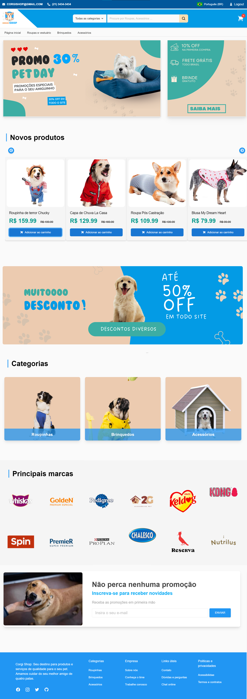

</details>

<details>
<summary>Página carrinho</summary>

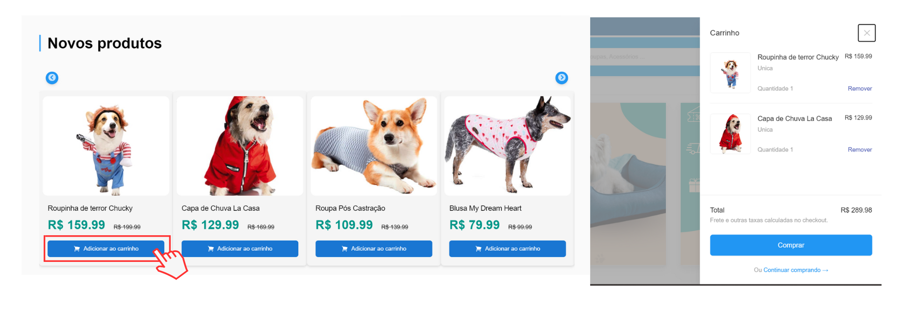

</details>

<details>
<summary>Página View Products</summary>

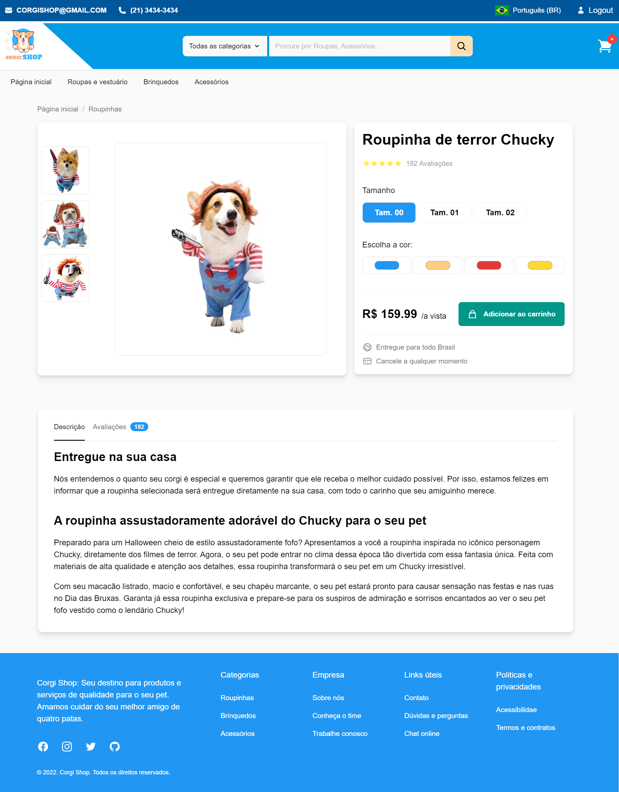

</details>

<details>
<summary>Página Login e Registro</summary>

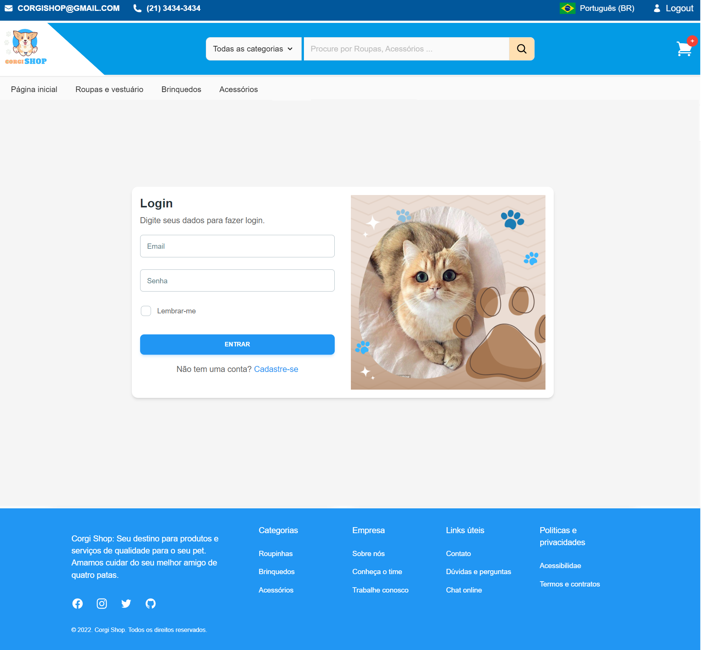
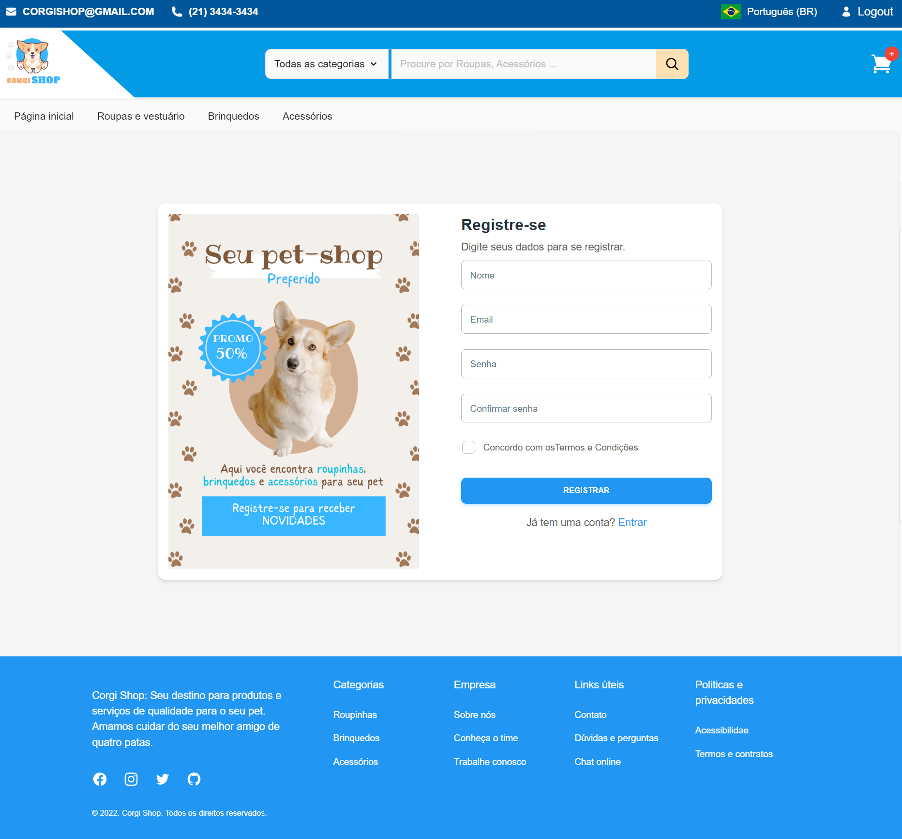

</details>

<details>
<summary>Página Checkout</summary>

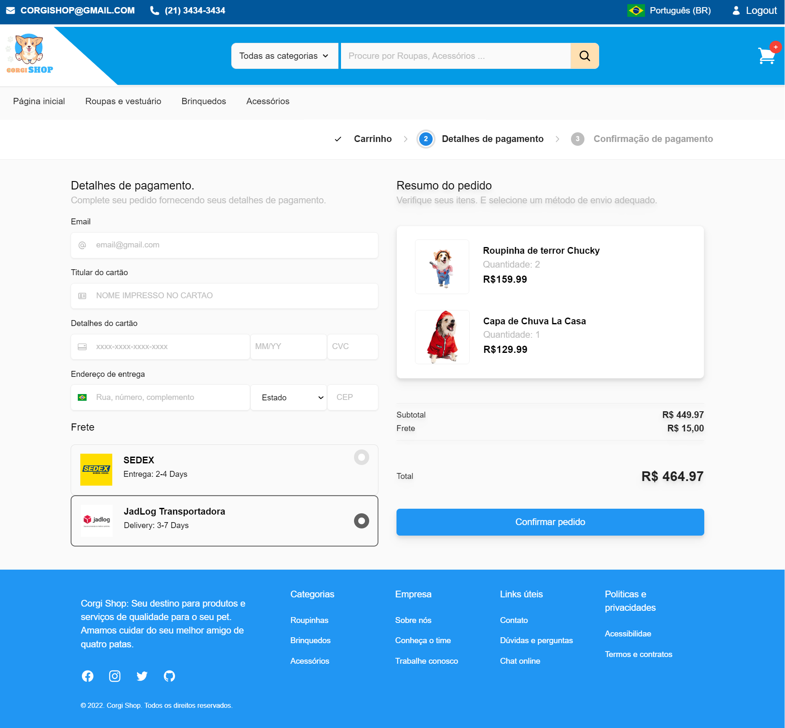
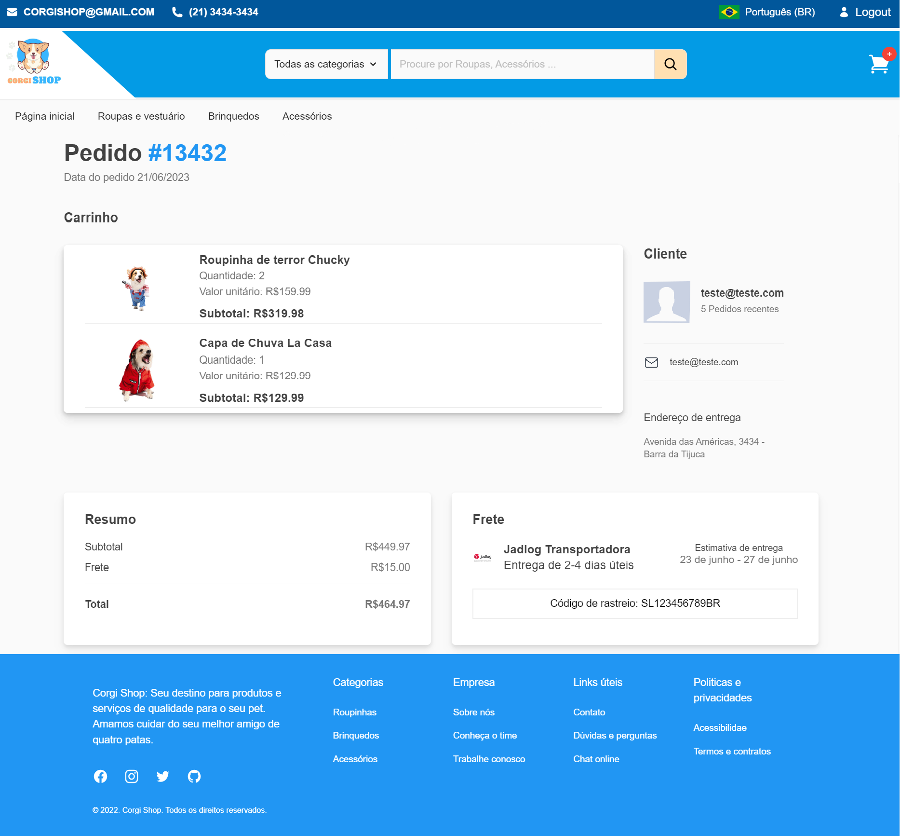

</details>


### Funcionalidades


#### Componente de produtos

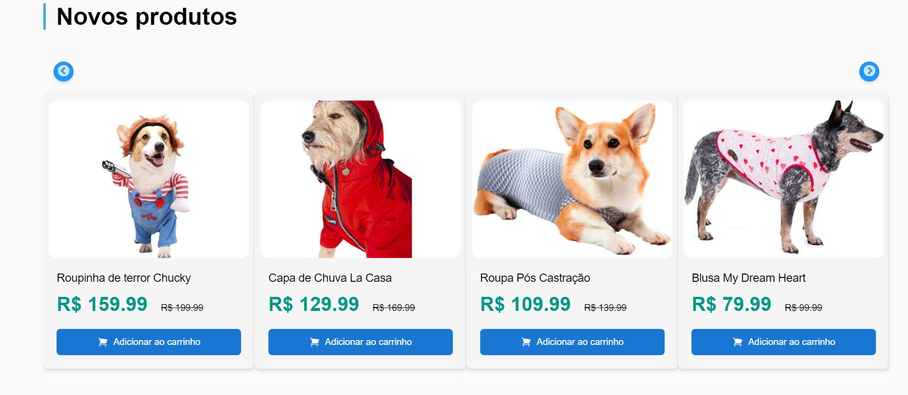

O componente Product exibe uma seção de produtos em um carrossel dinâmico. Ele busca os produtos através do endpoint `/product` e exibe as informações como nome, imagem e valor. Os usuários podem adicionar produtos ao carrinho clicando em um botão. O componente oferece uma experiência interativa para visualizar e adicionar produtos ao carrinho.

---

#### Componente de carrinho


A funcionalidade do carrinho é a seguinte: ao clicar em "Adicionar ao Carrinho", a função puxa o `email` do usuário e o `product_id` para enviar uma requisição para o endpoint `/add-cart`, que adiciona o produto ao carrinho do cliente. Ao clicar no ícone do carrinho, um carrinho lateral é aberto, exibindo a imagem, nome e valor de todos os produtos. Além disso, é realizada a soma dos valores dos produtos, exibindo o valor total sem considerar o frete.

---

#### Tela ViewProducts

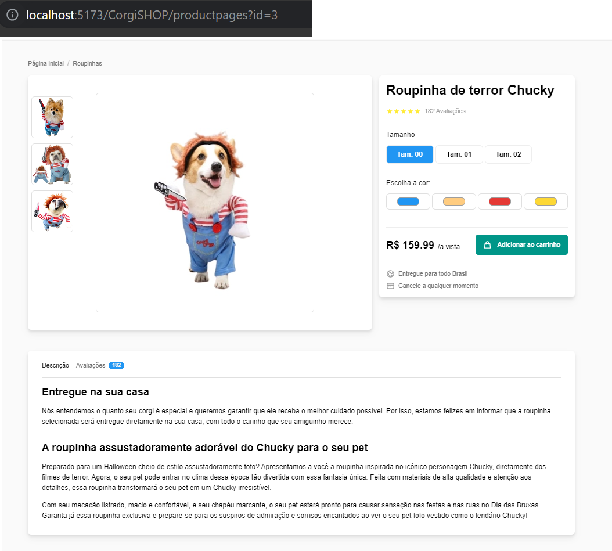

A Tela ViewProducts é uma página de visualização de produtos dinâmica. Ele recebe o `product_id` por meio da URL e cria a página com base nas informações desse produto específico. Ele usa o React Router para obter o `product_id` da URL e, em seguida, faz uma solicitação para obter os detalhes do produto usando o ID. A página exibe o nome, avaliação, tamanho e imagens do produto. Também permite adicionar o produto ao carrinho por meio de uma solicitação POST para uma API. A página é renderizada de forma dinâmica, exibindo as informações corretas para cada produto com base no ID fornecido.

---

#### Tela Checkout

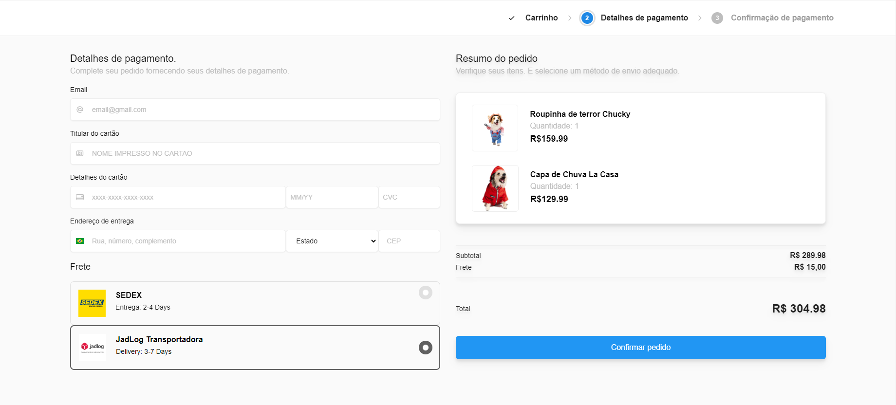

O código acima é um componente CheckoutForm. O componente é responsável por exibir um formulário de checkout, permitindo que os usuários insiram os detalhes de pagamento e endereço de entrega. Ele utiliza hooks como useState e useEffect para gerenciar o estado e os efeitos colaterais necessários para atualizar as informações do carrinho de compras e exibir os dados corretos aos usuários referentes ao response do endpoint `/get-cart`. 

Abaixo temos a segunda parte do Checkout que é a confirmação de pedido, que mostra que o pedido foi efetuado, com seu código de rastrio e informações da conta do usuário.

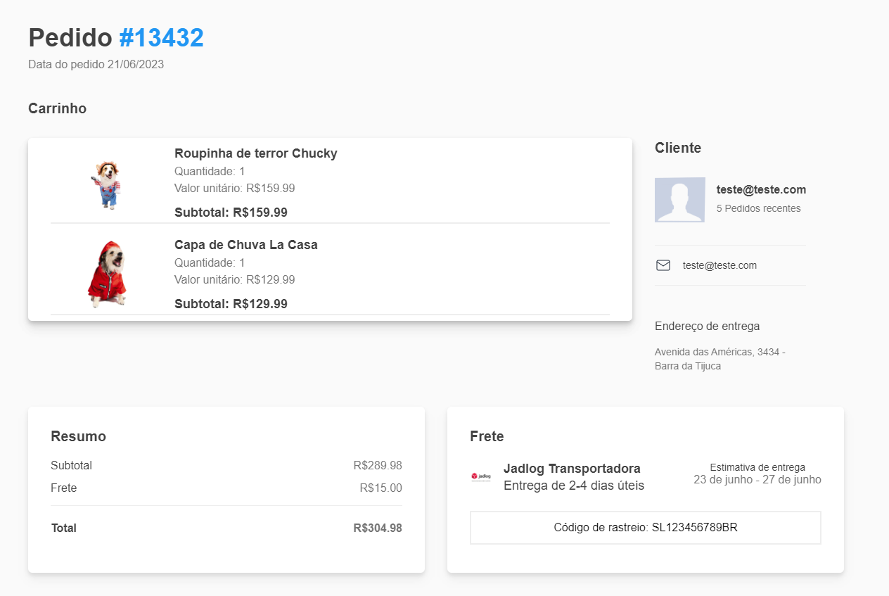

---

#### Tela de Autenticaão


A página de autenticação fornecido consiste em dois componentes principais: Login e AuthenticationPage. O componente Login lida com a lógica de autenticação, incluindo o envio de requisições à API e a validação dos dados de login. Ele também lida com o armazenamento do email no localStorage após o login bem-sucedido. O componente AuthenticationPage é responsável por exibir o formulário de login e registro, permitindo que o usuário alterne entre eles.


---

## License

O código CorgiSHOP do PatrickSoares-Dev está licenciada nos termos da licença de código aberto GPL (General Public License) e está disponível gratuitamente.


